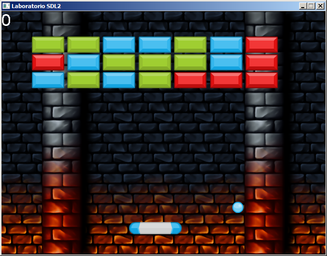

# Introduction 
Projeto laboratório para implementação de um jogo exemplo utilizando a biblioteca SDL 2

### Getting Started
1.	Realize o download das bibliotecas de desenvolvimento do SDL em [https://www.libsdl.org/download-2.0.php](https://www.libsdl.org/download-2.0.php)
2.	Edite os arquivos SDL2_x86.props e SDL2_x64.props para definir a localização dos arquivos da biblioteca SDL
3.	Copie a SDL.dll para c:\windows\system32, evitando assim copiar essa DLL para o diretório do projeto

### Others libs

https://www.libsdl.org/projects/SDL_image/
https://www.libsdl.org/projects/SDL_mixer/
https://www.libsdl.org/projects/SDL_ttf/
https://www.libsdl.org/projects/SDL_net/

### Preview

